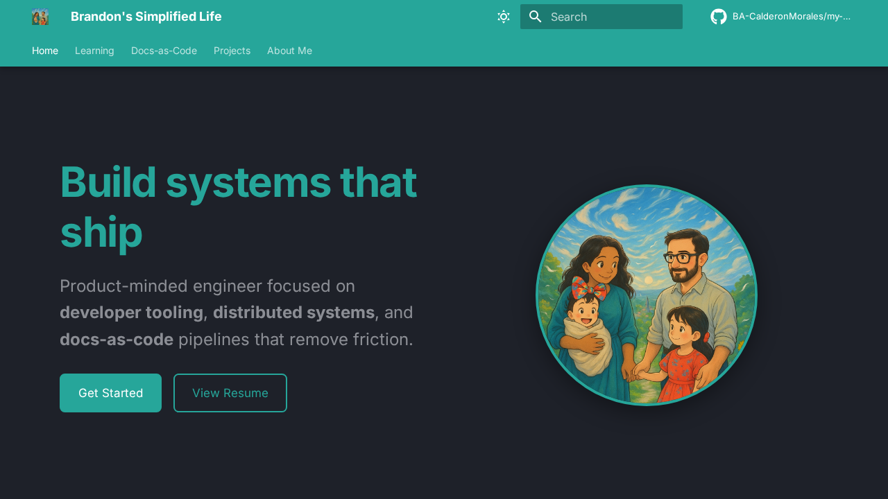

# My Life As A Dev

[](https://github.com/BA-CalderonMorales/my-life-as-a-dev/actions)
[](https://github.com/BA-CalderonMorales/my-life-as-a-dev/blob/main/LICENSE)
[](https://ba-calderonmorales.github.io/my-life-as-a-dev/)

<p align="center">
  <a href="https://ba-calderonmorales.github.io/my-life-as-a-dev/">
    
  </a>
</p>

<p align="center">
  <strong>A living documentation hub for projects, learning notes, and technical references.</strong><br>
  Powered by MkDocs Material + Zensical with versioned releases via mike.
</p>

## Quick Links

| Resource | Description |
|----------|-------------|
| [Live Documentation](https://ba-calderonmorales.github.io/my-life-as-a-dev/) | Browse the latest published docs |
| [Learning Section](https://ba-calderonmorales.github.io/my-life-as-a-dev/learning/) | Algorithms, data structures, and interview prep |
| [Projects](https://ba-calderonmorales.github.io/my-life-as-a-dev/projects/) | Active projects and experiments |

## Features

- **Versioned Documentation** - Every release is preserved with mike
- **Dual Build System** - MkDocs Material (stable) + Zensical (modern, 20x faster)
- **Rust-powered CLI** - doc-cli for setup, serving, version bumps, and deploys
- **GitHub Pages Pipeline** - Automatic builds and deploys on every push
- **Dark/Light Mode** - Toggle between themes with one click

## Getting Started

### GitHub Codespaces (Recommended)

1. Click the green **Code** button and select **Open with Codespaces**
2. Wait for the container to build, then run:
   ```bash
   ./doc-cli.sh
   ```
3. Select from the interactive menu:
   - startup - Start MkDocs dev server (port 8000)
   - zen-serve - Start Zensical dev server (port 8001, faster)

### Local Development

**Prerequisites:** Python 3.10+ and [uv](https://docs.astral.sh/uv/) (recommended)

```bash
# Clone and enter the repo
git clone https://github.com/BA-CalderonMorales/my-life-as-a-dev.git
cd my-life-as-a-dev

# Create virtual environment
python -m venv .venv
source .venv/bin/activate  # Windows: .venv\Scripts\activate

# Install dependencies
make setup

# Start dev server (choose one)
make serve      # MkDocs on port 8000
make zen-serve  # Zensical on port 8001 (faster)
```

## Documentation CLI

The Rust-powered doc-cli provides a unified interface for all documentation tasks:

```
doc-cli [COMMAND]

MkDocs Commands:
  startup              Start MkDocs development environment

Zensical Commands:
  zen-serve            Start Zensical dev server (port 8001)
  zen-build            Build site with Zensical

Version & Deploy:
  bump-version         Create a new documentation version
  deploy               Publish all versions to GitHub Pages
  help                 Show available commands
```

Run ./doc-cli.sh with no arguments for an interactive menu.

## Build Performance

| Build System | Time | Notes |
|--------------|------|-------|
| MkDocs Material | ~8s | Full-featured, production-ready |
| Zensical | ~0.4s | Modern, 20x faster builds |

Both systems produce identical site structure and can be used interchangeably.

## Repository Layout

```
my-life-as-a-dev/
├── docs/                  # Documentation content and assets
├── mkdocs.yml             # MkDocs configuration
├── zensical.toml          # Zensical configuration
├── mkdocs_plugins/        # Custom MkDocs plugins
├── scripts/rust/          # Rust CLI source (doc-cli)
├── scripts/python/        # Python helper scripts
├── e2e/                   # End-to-end tests
└── site/                  # Built static site (gitignored)
```

## Contributing

1. Fork the repository
2. Create a feature branch
3. Make your changes
4. Run make build to verify
5. Submit a pull request

See [CONTRIBUTING.md](CONTRIBUTING.md) for detailed guidelines.

## License

This project is licensed under the MIT License - see the [LICENSE](LICENSE) file for details.