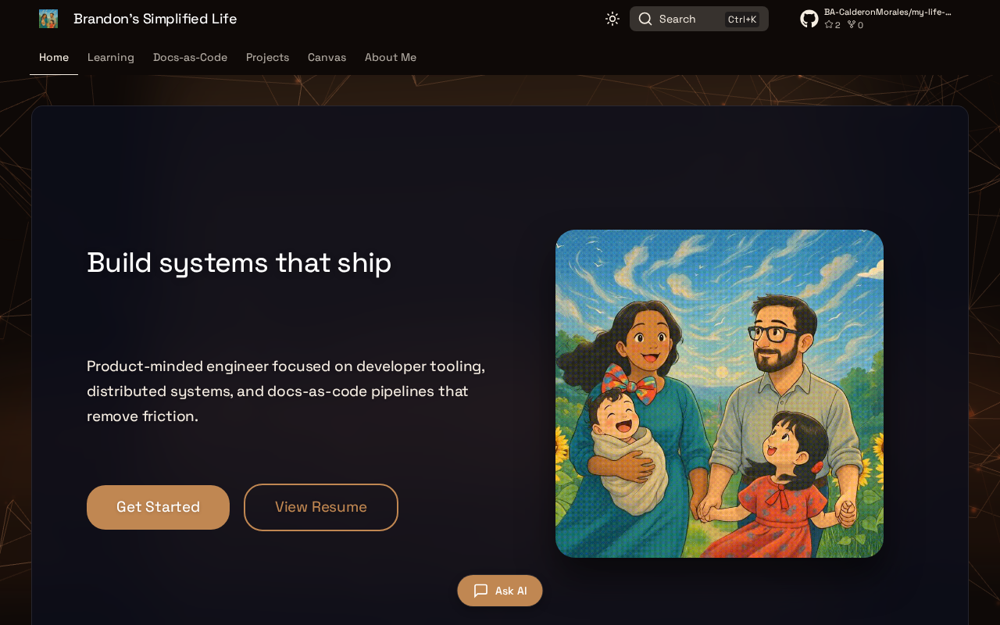

# Brandon's Simplified Life

[](https://github.com/BA-CalderonMorales/my-life-as-a-dev/actions)
[](https://github.com/BA-CalderonMorales/my-life-as-a-dev/blob/main/LICENSE)
[](https://ba-calderonmorales.github.io/my-life-as-a-dev/)

The repository behind a versioned docs-and-project hub for developer tooling, learning notes, platform experiments, and docs-as-code workflows. It doubles as a working reference for Zensical builds, Rust CLI automation, versioned releases, image optimization, and the site AI assistant.



## Explore

- [Live Documentation](https://ba-calderonmorales.github.io/my-life-as-a-dev/) for the published site
- [Docs-as-Code](https://ba-calderonmorales.github.io/my-life-as-a-dev/docs-as-code/) for build, workflow, AI, and security notes
- [Learning](https://ba-calderonmorales.github.io/my-life-as-a-dev/learning/) for algorithms, data structures, interview prep, and cloud AI notes
- [Projects](https://ba-calderonmorales.github.io/my-life-as-a-dev/projects/) for active tools, experiments, and implementation details
- [Resume](https://ba-calderonmorales.github.io/my-life-as-a-dev/resume/) for the current profile and experience summary
- [Kimi Cheat Sheet](https://github.com/BA-CalderonMorales/kimi-cheat-sheet) and [Codex Cheat Sheet](https://github.com/BA-CalderonMorales/codex-cheat-sheet) for AI CLI quick references

## What Lives Here

- `docs/` contains the published content, landing pages, project docs, and learning material
- `config/zensical/` is the editable source of truth for site configuration
- `zensical.toml` is generated from the modular config before serve and build
- `scripts/rust/` contains `doc-cli`, the Rust tool used for local workflows and release tasks
- `scripts/python/` contains deploy helpers, config merge tooling, and image optimization code
- `e2e/` and `tests/` cover shared UI behavior and plugin logic

## Run It Locally

Prerequisites: Python 3.10+, [`uv`](https://docs.astral.sh/uv/), and Rust/Cargo only if you want to rebuild `doc-cli`.

```bash
git clone https://github.com/BA-CalderonMorales/my-life-as-a-dev.git
cd my-life-as-a-dev
uv venv .venv
make setup
make serve
```

Open `http://localhost:8001/my-life-as-a-dev/`.

Useful commands:

```bash
make build
./doc-cli.sh
```

`make build` validates the site output. `./doc-cli.sh` rebuilds and launches the Rust CLI wrapper when you want the interactive menu or release tooling.

## Validate And Release

```bash
make build
./doc-cli help
./doc-cli validate
./doc-cli nav-check
./doc-cli update <version> --alias latest --push
```

## License

MIT License. See [LICENSE](LICENSE).

---
*Last synced: 2026-03-30 via [workspace manager](https://github.com/BA-CalderonMorales)*
