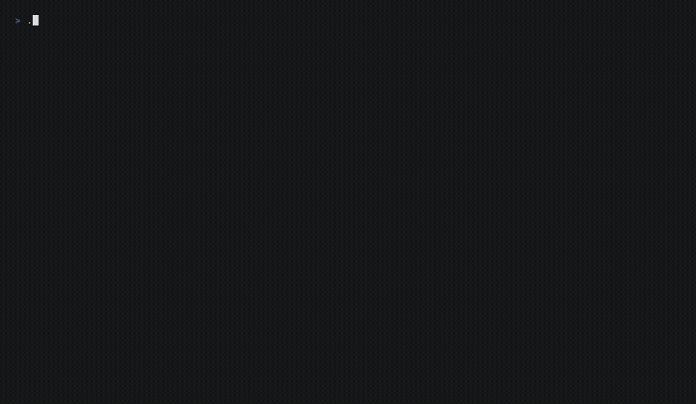

<div align="center">

# My Life as a Dev

**A docs-as-code site that treats a career like an open-source project**

[](https://ba-calderonmorales.github.io/my-life-as-a-dev/)
[](https://github.com/BA-CalderonMorales/my-life-as-a-dev/actions)
[](https://opensource.org/licenses/MIT)



</div>

## Install

Run the site locally with `uv`; Rust/Cargo is only needed to rebuild
`doc-cli` from source.

```bash
git clone https://github.com/BA-CalderonMorales/my-life-as-a-dev.git
cd my-life-as-a-dev
uv venv .venv
make setup
```

Prerequisites: Python 3.14+, [`uv`](https://docs.astral.sh/uv/).

## Quick Start

```bash
make serve
```

Open `http://localhost:8001/my-life-as-a-dev/`. The landing page is a living
index: a generated tree whose branches open the five facets of the site.

Prefer the interactive menu? Bare `doc-cli` opens it and stays open until you
type `exit`:

```bash
./doc-cli.sh
```

## Commands

Everything runs through one Rust front door, `doc-cli` (wrapped by
`doc-cli.sh`, which rebuilds the binary when its sources change). Commands
work headless (`./doc-cli <command>`) or from the interactive menu.

| Command | Purpose |
|---|---|
| `serve` | Zensical dev server on :8001 |
| `build` | Build the site with Zensical |
| `kill` | Stop dev servers and free ports 8000/8001 |
| `info` | Project structure and configuration overview |
| `validate` | Validate `zensical.toml` and referenced files |
| `nav-check` | Find markdown pages missing from navigation |
| `bump-version` | Bump the documentation version |
| `deploy [VERSION]` | Deploy a versioned release to GitHub Pages |
| `update [VERSION]` | One-shot version update/deploy helper |
| `setup` | Install dependencies and start the server |
| `help` | The full command map |

Make aliases: `make serve`, `make build`, `make test`, `make e2e`,
`make viewport-check`, `make accessibility-check`.

## Layout

The repository is a few small planes, and every domain is bucketed the same
way — once you can read one, you can read them all.

```text
docs/                           # published content (slim: one landing page)
docs/assets/                    # CSS, JS, images for the published site
docs-archive/                   # retired sections + staged ones (blog, doc-cli)
config/zensical/                # modular config, merged into zensical.toml
scripts/rust/                   # doc-cli: the Rust front door
scripts/python/                 # site tooling: config merge, tree generator
scripts/demo/                   # the VHS tape behind docs/demo-doc-cli.gif
e2e/                            # Playwright browser suite
tests/                          # unit contracts for config and plugins
```

`zensical.toml` is generated from `config/zensical/*.toml` before every
serve/build. Staged sections live in `docs-archive/` with their nav entries
and feature flags ready — publishing one is a flag flip, not a rewrite.

## Docs

Browse the published site: [live index](https://ba-calderonmorales.github.io/my-life-as-a-dev/), plus
[Docs-as-Code](https://ba-calderonmorales.github.io/my-life-as-a-dev/docs-as-code/),
[Learning](https://ba-calderonmorales.github.io/my-life-as-a-dev/learning/),
[Projects](https://ba-calderonmorales.github.io/my-life-as-a-dev/projects/),
and [Resume](https://ba-calderonmorales.github.io/my-life-as-a-dev/resume/).

| Document | What |
|---|---|
| [Docs-as-Code](https://ba-calderonmorales.github.io/my-life-as-a-dev/docs-as-code/) | Build, workflow, AI, and security notes |
| [Staged: Blog](docs-archive/blog/index.md) | Long-form writing, coming soon |
| [Staged: Doc-CLI](docs-archive/doc-cli/index.md) | The doc-cli executable, documented |
| [AI CLI cheat sheets](https://github.com/BA-CalderonMorales/kimi-cheat-sheet) | Kimi and Codex quick references |

## License

MIT
