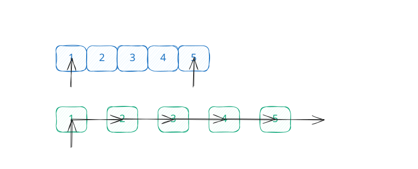
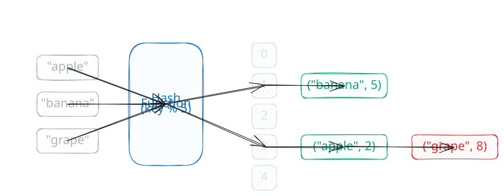
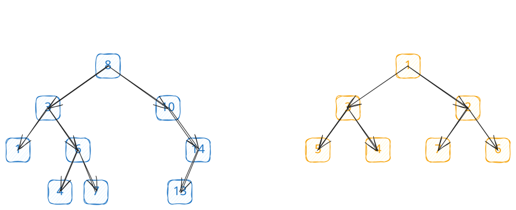
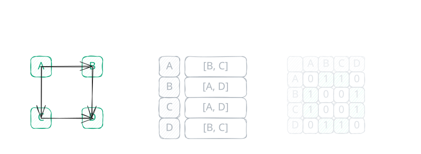
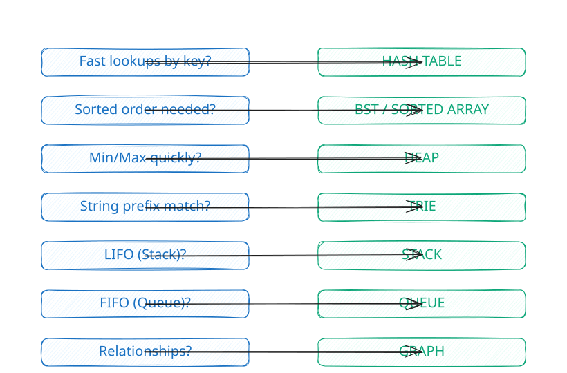

# Data Structures

Choosing the right data structure is half the battle. This guide helps you understand when and why to use each structure, with complexity analysis and practice links.

-   :material-view-list:{ .lg .middle } **Linear Structures**

    ---

    Arrays, Linked Lists, Stacks, Queues. Foundation for everything else.

    [:octicons-arrow-right-24: Jump to Linear](#linear-structures)

-   :material-code-braces:{ .lg .middle } **Associative Structures**

    ---

    Hash Tables and Sets for O(1) lookups and membership tests.

    [:octicons-arrow-right-24: Jump to Associative](#associative-structures)

-   :material-file-tree:{ .lg .middle } **Hierarchical Structures**

    ---

    Trees, Heaps, and Tries for ordered data and prefix operations.

    [:octicons-arrow-right-24: Jump to Trees](#hierarchical-structures)

-   :material-graph:{ .lg .middle } **Graph Structures**

    ---

    Adjacency lists and matrices for modeling relationships.

    [:octicons-arrow-right-24: Jump to Graphs](#graph-structures)

---

## Linear Structures

Sequential data with defined ordering and position-based access.

| Structure | Best For | Operations | Links |
|-----------|----------|------------|-------|
| **Arrays** | Random access, iteration, prefix sums | Index O(1), Search O(n) | [LC 238](https://leetcode.com/problems/product-of-array-except-self/) |
| **Linked Lists** | Frequent insertions, no reallocation | Insert O(1), Access O(n) | [LC 206](https://leetcode.com/problems/reverse-linked-list/) |
| **Stacks** | LIFO, undo/redo, parentheses matching | Push/Pop O(1) | [LC 20](https://leetcode.com/problems/valid-parentheses/) |
| **Queues** | FIFO, BFS traversal, scheduling | Enqueue/Dequeue O(1) | [LC 933](https://leetcode.com/problems/number-of-recent-calls/) |

---

## Associative Structures

Key-value mappings and membership testing with constant-time operations.

| Structure | Best For | Operations | Links |
|-----------|----------|------------|-------|
| **Hash Tables** | Counting, deduplication, lookups | Get/Set O(1) avg | [LC 1](https://leetcode.com/problems/two-sum/) |
| **Hash Sets** | Unique elements, membership tests | Add/Contains O(1) avg | [LC 217](https://leetcode.com/problems/contains-duplicate/) |

---

## Hierarchical Structures

Tree-based structures for ordered access and hierarchical relationships.

| Structure | Best For | Operations | Links |
|-----------|----------|------------|-------|
| **Binary Trees** | Traversals, depth calculations | Varies by balance | [LC 104](https://leetcode.com/problems/maximum-depth-of-binary-tree/) |
| **Binary Search Trees** | Ordered data, range queries | O(log n) balanced | [LC 98](https://leetcode.com/problems/validate-binary-search-tree/) |
| **Heaps** | Top-k, scheduling, priority queues | Insert/Extract O(log n) | [LC 347](https://leetcode.com/problems/top-k-frequent-elements/) |
| **Tries** | Prefix matching, autocomplete | O(m) where m=key length | [LC 208](https://leetcode.com/problems/implement-trie-prefix-tree/) |

---

## Graph Structures

Model relationships and connections between entities.

| Structure | Best For | Space | Links |
|-----------|----------|-------|-------|
| **Adjacency List** | Sparse graphs, traversals | O(V + E) | [LC 200](https://leetcode.com/problems/number-of-islands/) |
| **Adjacency Matrix** | Dense graphs, edge lookups | O(V^2) | [LC 547](https://leetcode.com/problems/number-of-provinces/) |

---

## Specialized Structures

Advanced structures for specific problem domains.

-   :material-filter:{ .lg .middle } **Probabilistic**

    ---

    Bloom Filters, HyperLogLog, Count-Min Sketch. Trade accuracy for speed/space.

    [:octicons-arrow-right-24: Explore](probabilistic/index.md)

-   :material-map-marker:{ .lg .middle } **Spatial**

    ---

    Quadtrees, K-D Trees, R-Trees. Efficient geographic and multi-dimensional queries.

    [:octicons-arrow-right-24: Explore](spatial/index.md)

-   :material-pine-tree:{ .lg .middle } **Advanced Trees**

    ---

    Segment Trees, Fenwick Trees, B-Trees. Range queries and database indexes.

    [:octicons-arrow-right-24: Explore](advanced_trees/index.md)

---

## Complexity Reference

Master this table for interviews.

| Structure | Access | Search | Insert | Delete | Space |
|-----------|--------|--------|--------|--------|-------|
| **Array** | O(1) | O(n) | O(n) | O(n) | O(n) |
| **Linked List** | O(n) | O(n) | O(1)* | O(1)* | O(n) |
| **Hash Table** | - | O(1) | O(1) | O(1) | O(n) |
| **BST (balanced)** | - | O(log n) | O(log n) | O(log n) | O(n) |
| **Heap** | O(1) top | O(n) | O(log n) | O(log n) | O(n) |
| **Trie** | - | O(m) | O(m) | O(m) | O(n*m) |

*\* At known position. m = key length, n = number of elements*

---

## Decision Guide

