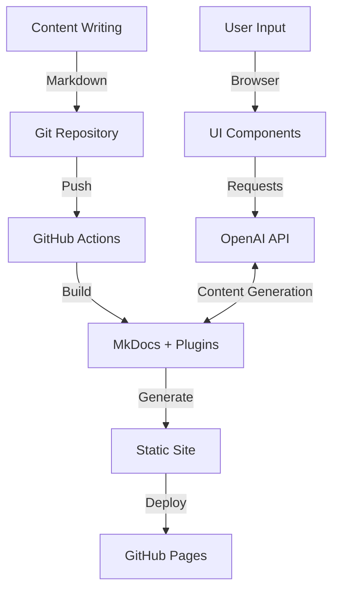

# Docs-as-Code Platform

This documentation site is built following the **Docs-as-Code** philosophy, treating documentation with the same care and processes as software code.

## What is Docs-as-Code?

Docs-as-Code is an approach to documentation that applies software development principles and tools to the process of creating and maintaining documentation:

- **Version Control**: Documentation is stored in Git repositories
- **CI/CD**: Automated build and deployment pipelines
- **Code Review**: Pull requests and reviews for documentation changes
- **Issue Tracking**: Using GitHub Issues for documentation improvements
- **Markdown**: Writing docs in plain text formats optimized for readability

## Our Platform Features

### 🚀 Core Technologies

This site leverages several powerful technologies:

- **[MkDocs](https://www.mkdocs.org/)**: A fast, simple static site generator
- **[Material for MkDocs](https://squidfunk.github.io/mkdocs-material/)**: A beautiful, feature-rich theme
- **[Mike](https://github.com/jimporter/mike)**: Version management for MkDocs
- **[GitHub Actions](https://github.com/features/actions)**: CI/CD automation
- **[GitHub Pages](https://pages.github.com/)**: Hosting platform

### 🔌 Custom Plugins & Integrations

We've extended the standard MkDocs capabilities with:

- **[OpenAI Integration](./ai-demo.md)**: AI-assisted content generation
- **Version Management**: Multiple documentation versions via mike
- **Custom CLI Tools**: Rust-based utilities for documentation management

### 🤖 AI Integration

Our AI integration plugin provides:

1. **Content Generation**: Create summaries, examples, and explanations
2. **Code Samples**: Generate relevant code snippets based on natural language descriptions
3. **Documentation Enhancement**: Improve existing content with AI suggestions

See the [AI Demo](./ai-demo.md) for a live demonstration.

## Implementation Architecture

## Best Practices

When working with this docs-as-code platform:

1. **Make small, focused changes** to documentation
2. **Test locally** before submitting pull requests (`mkdocs serve`)
3. **Use meaningful commit messages** that explain the purpose of changes
4. **Include examples** in your documentation
5. **Link related content** to create a connected knowledge base
6. **Consider versioning** for significant documentation updates

## Future Enhancements

We plan to extend this platform with:

- **Interactive API Documentation**: Live API testing capabilities
- **User Feedback System**: Collect and track user suggestions
- **Extended AI Capabilities**: More advanced content generation and analysis
- **Localization Support**: Multilingual documentation