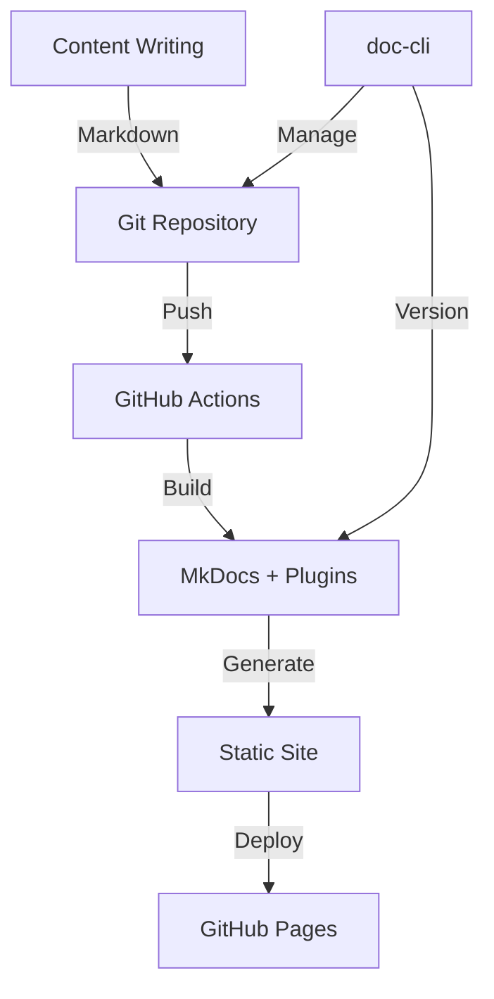

# Docs-as-Code Platform

This documentation site is built following the **Docs-as-Code** philosophy, treating documentation with the same care and processes as software code.

---

## What is Docs-as-Code?

Docs-as-Code is an approach to documentation that applies software development principles and tools to the process of creating and maintaining documentation:

- :material-git: **Version Control**: Documentation is stored in Git repositories
- :material-github-actions: **CI/CD**: Automated build and deployment pipelines
- :material-source-pull: **Code Review**: Pull requests and reviews for documentation changes
- :material-bug: **Issue Tracking**: Using GitHub Issues for documentation improvements
- :material-language-markdown: **Markdown**: Writing docs in plain text formats optimized for readability

---

## Our Platform Features

### :material-rocket-launch: Core Technologies

This site leverages several powerful technologies:

- **[MkDocs](https://www.mkdocs.org/)**: A fast, simple static site generator
- **[Material for MkDocs](https://squidfunk.github.io/mkdocs-material/)**: A beautiful, feature-rich theme
- **[Mike](https://github.com/jimporter/mike)**: Version management for MkDocs
- **[GitHub Actions](https://github.com/features/actions)**: CI/CD automation
- **[GitHub Pages](https://pages.github.com/)**: Hosting platform

### :material-tools: Custom Tools & Extensions

We've extended the standard MkDocs capabilities with:

- :material-console: **Rust CLI (`doc-cli`)**: Custom command-line tool for documentation management
    - `startup`: Sets up dev environment and starts MkDocs server
    - `bump-version`: Creates new semantic version tags
    - `deploy`: Deploys all versions to GitHub Pages

- :material-git: **Version Management**: Multiple documentation versions via mike
- :material-file-code: **Custom Plugins**: Extensible plugin system for future enhancements
- :material-script-text: **Automation Scripts**: Python utilities for repository synchronization

### :material-robot: AI Integration (Future)

**Note**: AI chat features are currently disabled in production. See `AGENTS.md` for security requirements before enabling.

Planned capabilities:
1. **Per-Page Chat**: Ask questions about specific documentation pages
2. **Content Enhancement**: AI-assisted documentation improvements
3. **Code Examples**: Generate relevant code snippets from descriptions

The infrastructure is in place (`scripts/python/ai_proxy.py`) but requires secure deployment before activation.

---

## Implementation Architecture



---

## Automation Scripts

Helper scripts in `scripts/python` keep repository pages up to date:

- **`generate_repo_pages.py`**: Fetches README files and generates documentation pages
    - `--base-dir`: Control where pages are written
    - `--force-refresh`: Bypass cache when fetching files

- **`sync_repo_docs.py`**: Synchronizes repository documentation
- **`utils.py`**: Shared utilities for cached HTTP requests

**Authentication**: Set `GH_TOKEN` or `GITHUB_TOKEN` environment variable to authenticate GitHub requests and avoid rate limits.

---

## Development Workflow

### Local Development

```bash
# Setup dependencies (uses uv for Python)
make setup

# Start development server
make serve
# OR
doc-cli startup

# Build static site
make build
```

### Creating New Versions

```bash
# Interactive version bumping
doc-cli bump-version

# OR use the bash script
./scripts/bump-version.sh
```

The version management system:
- Creates Git tags with semantic versioning (major.minor.patch)
- Deploys multiple versions to GitHub Pages via `mike`
- Maintains "latest" alias automatically
- Enables users to switch between documentation versions

### CI/CD Pipeline

On push to `main` branch:
1. GitHub Actions triggers build workflow
2. Installs Python dependencies and custom plugins
3. Determines latest version tag (or defaults to "0.1.0")
4. Builds site with `mike deploy $VERSION latest --update-aliases`
5. Deploys to GitHub Pages

**Excluded from builds**: Changes to `AGENTS.md`, `CLAUDE.md`, `.cursorrules`, or `.devcontainer/**` won't trigger deployments.

---

## Best Practices

When working with this docs-as-code platform:

1. :material-pencil: **Make small, focused changes** to documentation
2. :material-test-tube: **Test locally** before submitting pull requests (`make serve`)
3. :material-message-text: **Use meaningful commit messages** following [Conventional Commits](https://www.conventionalcommits.org/)
4. :material-code-brackets: **Include examples** in your documentation
5. :material-link: **Link related content** to create a connected knowledge base
6. :material-tag: **Consider versioning** for significant documentation updates

### Commit Message Format

```
feat: add terminal-jarvis documentation
fix: correct broken links in projects page
chore: update dependencies
docs: improve quick start guide
```

---

## Project Structure

```
my-life-as-a-dev/
├── docs/                     # Documentation source
│   ├── .nav.yml             # Navigation configuration
│   ├── index.md             # Homepage
│   ├── projects/            # Projects overview
│   ├── repositories/        # Per-repository documentation
│   ├── docs-as-code/        # This page
│   ├── overrides/           # Theme customizations
│   └── assets/              # Images and static files
├── mkdocs.yml               # MkDocs configuration
├── requirements.txt         # Python dependencies
├── setup.py                 # Plugin installation
├── scripts/
│   ├── rust/                # doc-cli implementation
│   └── python/              # Automation utilities
├── mkdocs_plugins/          # Custom MkDocs plugins
├── AGENTS.md                # AI assistant guidelines
└── CLAUDE.md                # Claude Code specific guidance
```

---

## Custom CLI Tool

The `doc-cli` tool provides a unified interface for common documentation tasks:

```bash
# Interactive menu
doc-cli

# Specific commands
doc-cli startup              # Setup + start server
doc-cli bump-version         # Create new version
doc-cli deploy              # Deploy all versions
doc-cli deploy --force      # Force redeploy
doc-cli help                # Show help
```

Built in **Rust** for:
- :material-speedometer: Performance and reliability
- :material-shield-check: Type safety and error handling
- :material-puzzle: Modular architecture (each command is a separate module)
- :material-console-line: Beautiful terminal output

---

## Future Enhancements

Planned improvements for this platform:

- [ ] **Interactive API Documentation**: Live API testing capabilities
- [ ] **User Feedback System**: Collect and track user suggestions
- [ ] **AI Chat Feature**: Enable per-page Q&A (after security requirements met)
- [ ] **Localization Support**: Multilingual documentation (English/Spanish)
- [ ] **Search Analytics**: Track popular search queries
- [ ] **Dark Mode Toggle**: User preference for theme

---

## Contributing

This documentation is open source! Contributions are welcome:

1. Fork the [repository](https://github.com/BA-CalderonMorales/my-life-as-a-dev)
2. Create a feature branch (`git checkout -b feature/amazing-docs`)
3. Make your changes and test locally (`make serve`)
4. Commit with clear messages (`feat: add terminal-jarvis guide`)
5. Push and open a Pull Request

See `AGENTS.md` for detailed development guidelines.

---

## Philosophy

**Documentation deserves the same care as code.**

This platform demonstrates that principle by:
- Applying software engineering best practices to documentation
- Using version control and CI/CD for documentation
- Building custom tooling to improve the documentation workflow
- Treating documentation as a first-class citizen in the development process

The result is documentation that's:
- :material-check: Always up-to-date
- :material-check: Easy to navigate and search
- :material-check: Versioned for historical reference
- :material-check: Automatically deployed on every change

---

## Learn More

- **[MkDocs Documentation](https://www.mkdocs.org/)**: Official MkDocs guide
- **[Material for MkDocs](https://squidfunk.github.io/mkdocs-material/)**: Theme documentation
- **[Mike Documentation](https://github.com/jimporter/mike)**: Version management guide
- **[GitHub Pages](https://pages.github.com/)**: Hosting documentation

---

**This docs-as-code approach** is a demonstration of my commitment to treating documentation with the same rigor as production code—versioned, tested, and continuously deployed.