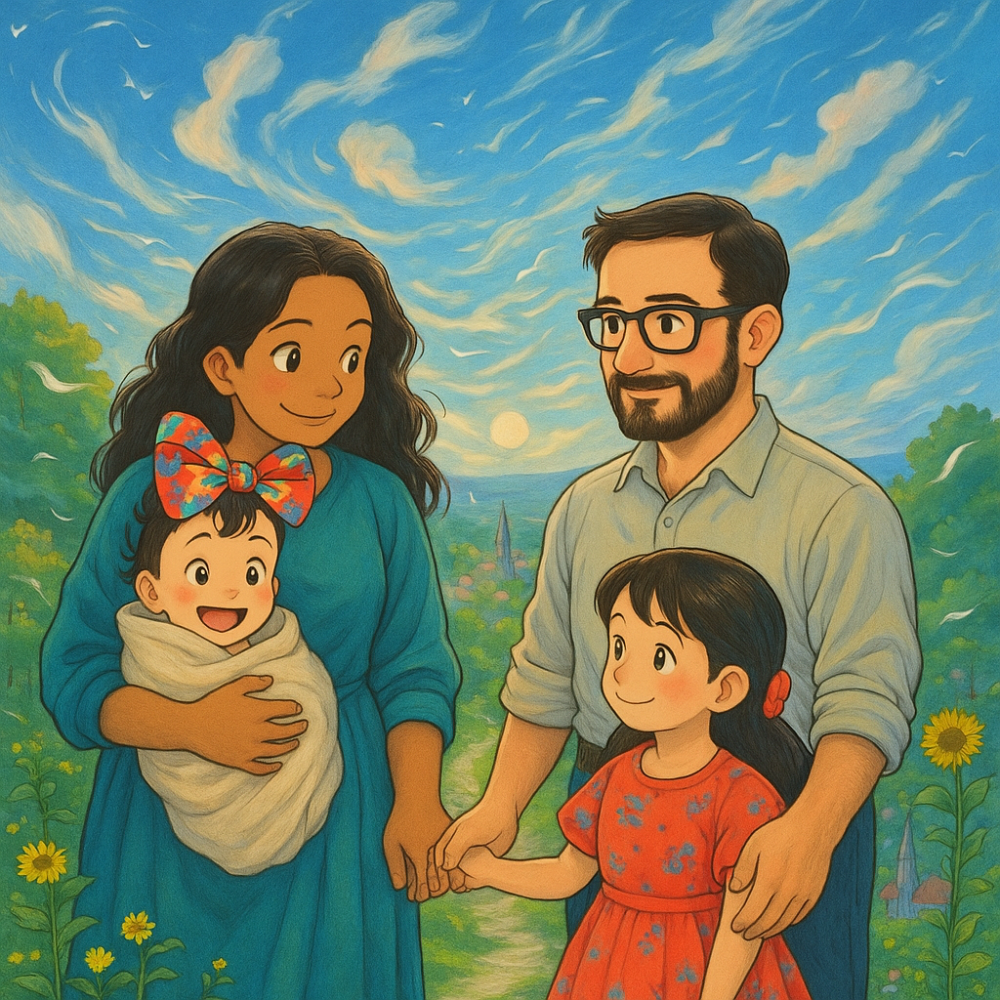

---
hide:
  - toc
  - navigation
---

<div markdown="1" class="home-page">

<div class="scroll-progress"></div>

<section class="hero-section" id="hero">



<h2>Hi, I'm Brandon A. Calderon Morales 👋</h2>

<p class="subtitle">
    <span class="typewriter-text" data-strings="Product-Minded Software Engineer|DevOps Transformation Specialist|Legacy Code Modernizer|Technical Mentor"></span><br>
    Omaha, Nebraska, United States
</p>

<div class="cta-container">

  <a class="cta-button" href="https://www.linkedin.com/comm/mynetwork/discovery-see-all?usecase=PEOPLE_FOLLOWS&followMember=bcalderonmorales-cmoe" target="_blank">
      <svg xmlns="http://www.w3.org/2000/svg" viewBox="0 0 24 24" width="24" height="24">
      <path fill="currentColor" d="M20.5 2h-17A1.5 1.5 0 002 3.5v17A1.5 1.5 0 003.5 22h17a1.5 1.5 0 001.5-1.5v-17A1.5 1.5 0 0020.5 2zM8 19H5v-9h3zM6.5 8.25A1.75 1.75 0 118.3 6.5a1.78 1.78 0 01-1.8 1.75zM19 19h-3v-4.74c0-1.42-.6-1.93-1.38-1.93A1.74 1.74 0 0013 14.19a.66.66 0 000 .14V19h-3v-9h2.9v1.3a3.11 3.11 0 012.7-1.4c1.55 0 3.36.86 3.36 3.66z"></path>
      </svg>
      Follow on LinkedIn
  </a>

  <a href="#explore" class="cta-button">
      <svg xmlns="http://www.w3.org/2000/svg" viewBox="0 0 24 24" width="24" height="24">
      <path fill="currentColor" d="M12 2C6.48 2 2 6.48 2 12s4.48 10 10 10 10-4.48 10-10S17.52 2 12 2zm0 18c-4.41 0-8-3.59-8-8s3.59-8 8-8 8 3.59 8 8-3.59 8-8 8zm-1-12h2v6h-2zm0 8h2v2h-2z"></path>
      </svg>
      Explore My Profile
  </a>

</div>

<div class="scroll-indicator" data-target="explore">

  <svg xmlns="http://www.w3.org/2000/svg" viewBox="0 0 24 24" width="24" height="24">
    <path fill="currentColor" d="M7.41 8.59L12 13.17l4.59-4.58L18 10l-6 6-6-6 1.41-1.41z"></path>
  </svg>

</div>

</section>

<div class="section-divider"></div>

<p class="tagline" id="explore">️🚀I build resilient code with strategic vision.🛠</p>

<div class="section-divider"></div>

<section class="tabbed-experience" id="tabs"></section>

<h2 class="section-title">Discover More About Me</h2>

<p class="section-subtitle">Explore different aspects of my professional journey and personal interests</p>

</div>

=== "Summary"

    ## Summary
        
    🛠️⚡ Mission-Driven Engineering | Resilience & Scale | Empower & Democratize

    I enjoy the challenge of learning new technologies, adapting to all scenarios, and championing efficiency within development teams. I'm also a father of two beautiful girls and a husband to a wonderful wife. Keep scrolling through this page to learn about me and use the left-hand side links to jump to other important/key sections about me. Cheers!
    
    ### Top Skills
    🔹 DevOps Transformation  
    🔹 CI/CD Pipeline Optimization  
    🔹 Legacy Code Modernization  
    🔹 Technical Mentorship  
    🔹 Process Standardization  

=== "Professional"

    ## Professional Background
    
    ### Team Leadership
    🔹 Leading DevOps transformations  
    🔹 Mentoring junior engineers  
    🔹 Cross-functional collaboration  
    🔹 Military leadership principles  
    🔹 Agile workflow optimization  

    ### Technical Expertise
    🔹 CI/CD pipeline design  
    🔹 System architecture  
    🔹 Legacy code modernization  
    🔹 Distributed systems  
    🔹 Development automation  

    ### Communication
    🔹 Technical documentation  
    🔹 Process standardization  
    🔹 Stakeholder engagement  
    🔹 Knowledge transfer  
    🔹 Teaching/training delivery  

    ### Languages
    🔹 English (Native)  
    🔹 Spanish (Conversational)  

    ### Certifications
    🔹 Full-Stack Web Development Certificate  
        
    ### Career Timeline
    ```mermaid
      gantt
          dateFormat  YYYY-MM-DD
          title Career Timeline
          section Software Engineering
          Software Engineer, Sr. Professional (Fiserv) :active, f1, 2024-01-01, 1y4m
          Software Engineer (Leidos)                      :active, f2, 2021-10-01, 1y8m
          Web Services Developer (Insight Global)         :active, f3, 2023-05-01, 7m
          section Military & Legal
          Military Trainee, Sr. Professional (Fiserv)       :active, m1, 2023-11-01, 3m
          Legal Chief (US Marine Corps)                     :active, m2, 2018-06-01, 11m
          Court Reporter (US Marine Corps)                  :active, m3, 2016-08-01, 1y10m
          Legal Specialist (US Marine Corps)                :active, m4, 2014-12-01, 1y9m
          Legal Administrative Assistant (Boys Town)        :active, m5, 2019-06-01, 3m
    ```

=== "Technical Skills"

    ## Technical Skills
        
    ### Technical Focus

    ```mermaid
    flowchart TD
        A[Software Engineering] --> B[CI/CD Optimization]
        A --> C[Distributed Systems]
        B --> D[Git & GitHub]
        B --> E[Jenkins / GitHub Actions]
        C --> F[Scalable Architecture]
        C --> G[Workflow Automation]
    ```

    ### Languages
    🔹 C#  
    🔹 SQL  
    🔹 JavaScript  
    🔹 TypeScript  
    🔹 XML  
    🔹 YAML  
    🔹 Groovy  
    🔹 Rust  

    ### Frameworks
    🔹 React  
    🔹 .NET 4.8  
    🔹 .NET 6+  

    ### Tools
    🔹 Visual Studio  
    🔹 VS Code  
    🔹 MSSQL  
    🔹 CyberArk  
    🔹 Splunk  
    🔹 Confluence  
    🔹 SharePoint  
    🔹 ServiceNow  
    🔹 Fortify SCA  
    🔹 Jenkins  
    🔹 GitHub Actions  

=== "Experience"

    ## Experience Highlights
        
    ### Fiserv
    🔹 **Role:** Software Engineer, Sr. Professional  
    🔹 **Duration:** January 2024 - Present (1 year 4 months)  
    🔹 **Location:** Omaha, Nebraska, United States  
    🔹 **Highlights:**  
        - Spearheaded migration from Jenkins to GitHub Actions to optimize CI/CD workflows.  
        - Resolved critical CI/CD issues and standardized workflows to boost team efficiency.  
        - Mentored junior engineers and contributed to high-level design and user story creation.  

    🔹 **Previous Role:** Military Trainee, Sr. Professional  
    🔹 **Duration:** November 2023 - January 2024 (3 months)  
    🔹 Gained insights into project management and business analysis as part of a specialized training program.  
    🔹 Enhanced soft skills including communication, teamwork, and leadership.  

    ### Insight Global
    🔹 **Role:** Web Services Developer  
    🔹 **Duration:** May 2023 - November 2023 (7 months)  
    🔹 **Location:** Bellevue, Nebraska, United States  
    🔹 **Highlights:**  
        - Developed and maintained web services using C#, SQL, and JavaScript.  
        - Managed design, implementation, refactoring, and bug fixes within a legacy codebase.  
        
    ### Leidos
    🔹 **Role:** Software Engineer  
    🔹 **Duration:** October 2021 - May 2023 (1 year 8 months)  
    🔹 **Location:** Omaha, Nebraska, United States  
    🔹 **Highlights:**  
        - Worked as both a Frontend and DevOps engineer.  
        - Configured development environments using Linux, VS Code, and Vim.  
        - Built and maintained shared React components and contributed to agile workflows.  

    ### Military Service

    #### United States Marine Corps
    🔹 **Legal Chief:** June 2018 - April 2019 (11 months) – Morón De La Frontera, Andalusia, Spain  
    🔹 **Court Reporter:** August 2016 - May 2018 (1 year 10 months) – Camp Lejeune, North Carolina  
    🔹 **Legal Specialist:** December 2014 - August 2016 (1 year 9 months) – Camp Lejeune, North Carolina  

    #### Boys Town National Research Hospital
    🔹 **Role:** Legal Administrative Assistant  
    🔹 **Duration:** June 2019 - August 2019 (3 months)  
    🔹 **Location:** Boys Town, Nebraska  

=== "Education"

    ## Education
        
    ### University
    🔹 **University of Nebraska at Omaha**  
      Bachelor's Degree in Multidisciplinary Studies (Computer Science Concentration)  
      *August 2013 - December 2025*  

    ### Certificates
    🔹 **devCodeCamp**  
      Certificate, Full-Stack Software Development  
      *May 2021 - August 2021*  

    ### Early Education
    🔹 **Omaha South Magnet High School**  
      High School Diploma  
      *2009 - 2013*  

=== "Connect"

    ## Connect with Me
        
    ### Professional
    🔹 [LinkedIn](https://www.linkedin.com/in/bcalderonmorales-cmoe)  
    🔹 [email me](mailto:brandon.ceemoe@gmail.com)  

    ### Social
    🔹 [Substack](https://substack.com/@bmoedude)  
    🔹 [Blue Sky](https://bsky.app/profile/moe-dude.bsky.social)  
    🔹 [YouTube](https://www.youtube.com/@brandoncalderon7008)  
    🔹 [Twitter](https://x.com/BrandonACalder1)  

    ### Technical
    🔹 [GitHub](https://github.com/BA-CalderonMorales)  
    🔹 [dockerhub:dev-environment](https://hub.docker.com/r/cmoe640/dev-environment)  

    ### Old school portfolio site
    🔹 [portfolio.dev](https://brandon-calderon-morales-portfolio.dev)  

## AI Experiments & Tools
    
<div class="featured-section ai-section">
  <div class="feature-cards">
    <div class="feature-card">
      <div class="feature-icon">🤖</div>
      <h3>AI Playground</h3>
      <p>Experiment with interactive AI tools that I've built to enhance creativity and productivity.</p>
      <a href="./ai-demo/ai-playground/index.md" class="feature-link">Explore the Playground</a>
    </div>
    
    <div class="feature-card">
      <div class="feature-icon">🧪</div>
      <h3>Visual Experiments</h3>
      <p>Check out my AI-assisted visual scenes and interactive experiments.</p>
      <a href="./blog/life/test_scenes/" class="feature-link">See Test Scenes</a>
    </div>
    
    <div class="feature-card">
      <div class="feature-icon">📘</div>
      <h3>AI Journey</h3>
      <p>Learn about how I've been integrating AI into documentation and creative projects.</p>
      <a href="./ai-demo/index.md" class="feature-link">Read My AI Story</a>
    </div>
  </div>
  
  <div class="ai-tools-showcase">
    <h3>Featured AI Tools</h3>
    <ul class="tool-list">
      <li><strong>Repository Explorer</strong>: Get AI-driven insights into code repositories</li>
      <li><strong>Interactive Scene Creator</strong>: Generate 3D scenes with AI assistance</li>
      <li><strong>Code Assistance</strong>: Leverage AI for code explanations and documentation</li>
    </ul>
  </div>
</div>

<div class="section-divider"></div>

<section class="final-cta" id="connect">
  <h2>Ready to Connect?</h2>
  <p>Thanks for visiting my profile! Feel free to explore more of my projects, experiences, and thoughts.</p>
  
  <div class="cta-container">
    <a href="https://www.linkedin.com/in/bcalderonmorales-cmoe" class="cta-button" target="_blank">
      <svg xmlns="http://www.w3.org/2000/svg" viewBox="0 0 24 24" width="24" height="24">
        <path fill="currentColor" d="M20.5 2h-17A1.5 1.5 0 002 3.5v17A1.5 1.5 0 003.5 22h17a1.5 1.5 0 001.5-1.5v-17A1.5 1.5 0 0020.5 2zM8 19H5v-9h3zM6.5 8.25A1.75 1.75 0 118.3 6.5a1.78 1.78 0 01-1.8 1.75zM19 19h-3v-4.74c0-1.42-.6-1.93-1.38-1.93A1.74 1.74 0 0013 14.19a.66.66 0 000 .14V19h-3v-9h2.9v1.3a3.11 3.11 0 012.7-1.4c1.55 0 3.36.86 3.36 3.66z"></path>
      </svg>
      Connect on LinkedIn
    </a>
    <a href="https://github.com/BA-CalderonMorales" class="cta-button" target="_blank">
      <svg xmlns="http://www.w3.org/2000/svg" viewBox="0 0 24 24" width="24" height="24">
        <path fill="currentColor" d="M12 2C6.477 2 2 6.477 2 12c0 4.42 2.87 8.17 6.84 9.5.5.08.66-.23.66-.5v-1.69c-2.77.6-3.36-1.34-3.36-1.34-.46-1.16-1.11-1.47-1.11-1.47-.91-.62.07-.6.07-.6 1 .07 1.53 1.03 1.53 1.03.87 1.52 2.34 1.07 2.91.83.09-.65.35-1.09.63-1.34-2.22-.25-4.55-1.11-4.55-4.92 0-1.11.38-2 1.03-2.71-.1-.25-.45-1.29.1-2.64 0 0 .84-.27 2.75 1.02.79-.22 1.65-.33 2.5-.33.85 0 1.71.11 2.5.33 1.91-1.29 2.75-1.02 2.75-1.02.55 1.35.2 2.39.1 2.64.65.71 1.03 1.6 1.03 2.71 0 3.82-2.34 4.66-4.57 4.91.36.31.69.92.69 1.85V21c0 .27.16.59.67.5C19.14 20.16 22 16.42 22 12A10 10 0 0012 2z"></path>
      </svg>
      View GitHub Projects
    </a>
    <a href="mailto:brandon.ceemoe@gmail.com" class="cta-button">
      <svg xmlns="http://www.w3.org/2000/svg" viewBox="0 0 24 24" width="24" height="24">
        <path fill="currentColor" d="M20 4H4c-1.1 0-1.99.9-1.99 2L2 18c0 1.1.9 2 2 2h16c1.1 0 2-.9 2-2V6c0-1.1-.9-2-2-2zm0 4l-8 5-8-5V6l8 5 8-5v2z"></path>
      </svg>
      Email Me
    </a>
  </div>
</section>

<footer class="landing-footer">
  <p>© <span class="copyright-year">2025</span> Brandon A. Calderon Morales</p>
</footer>

</div> <!-- End home-page div -->