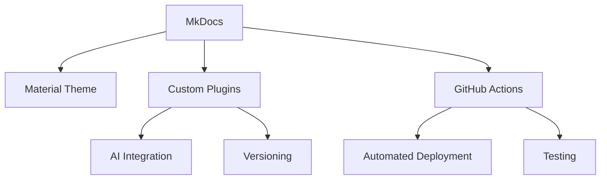

# Project Details

## Architecture Overview

The Docs-as-Code Portfolio is built with a modular architecture that separates concerns and promotes maintainability:



## Key Components

### 1. Documentation Engine
- **MkDocs**: Static site generator for project documentation
- **Material for MkDocs**: Modern UI framework with responsive design
- **Custom Plugins**: Extend functionality with Python-based plugins

### 2. AI Integration
- **OpenAI API**: Powers AI-assisted documentation features
- **Interactive Demos**: Live examples of AI capabilities
- **Secure Key Management**: Environment-based API key configuration

### 3. Versioning System
- **mike**: Version control for documentation
- **Semantic Versioning**: Clear version numbering (MAJOR.MINOR.PATCH)
- **Version Selector**: Easy navigation between versions

### 4. Development Tools
- **CLI Tool**: Rust-based command-line interface
- **Automated Workflows**: GitHub Actions for CI/CD
- **Testing Framework**: Automated testing infrastructure

## Configuration

### Environment Variables

| Variable | Required | Description |
|----------|----------|-------------|
| `OPENAI_API_KEY` | No | Your OpenAI API key for AI features |
| `PYTHONPATH` | Yes | Must include project root for plugin discovery |

### Project Structure

```
my-life-as-a-dev/
├── mkdocs.yml             # Main configuration
├── requirements.txt       # Python dependencies
├── mkdocs_plugins/        # Custom plugins
│   ├── ai_plugin/        # AI integration
│   └── version_plugin/   # Versioning support
├── docs/                  # Documentation source
│   ├── assets/           # Static files
│   ├── repositories/     # Project documentation
│   └── ...
└── scripts/              # Build and deployment scripts
    └── doc-cli.rs        # CLI tool
```

## Deployment

The project is automatically deployed to GitHub Pages using GitHub Actions:

1. **Production**: Pushes to `main` branch
2. **Preview**: Pull requests generate preview deployments
3. **Versioned**: Each release is preserved with versioned URLs

## Contributing

1. Fork the repository
2. Create a feature branch (`git checkout -b feature/amazing-feature`)
3. Commit your changes (`git commit -m 'Add some amazing feature'`)
4. Push to the branch (`git push origin feature/amazing-feature`)
5. Open a Pull Request

## License

This project is licensed under the Apache License 2.0 - see the [LICENSE](https://github.com/BA-CalderonMorales/my-life-as-a-dev/blob/main/LICENSE) file for details.

## Support

For issues and feature requests, please [open an issue](https://github.com/BA-CalderonMorales/my-life-as-a-dev/issues) on GitHub.
