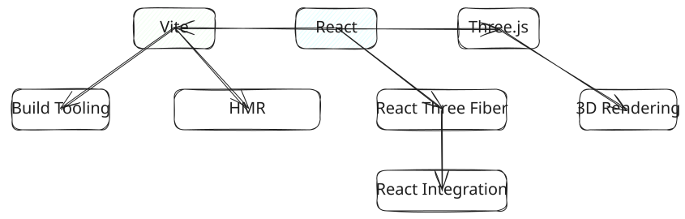
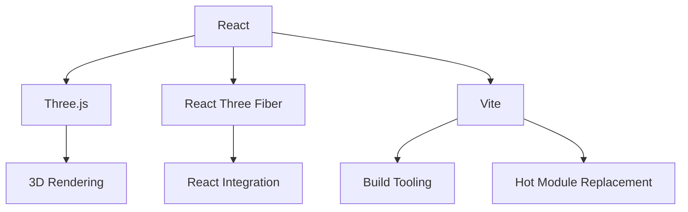

# Project Details

## Architecture Overview

Immersive Awe Canvas is built with modern web technologies to deliver smooth 3D experiences:

[](../../../../assets/images/diagrams/immersive-awe-canvas-architecture.excalidraw)

> **Note:** Click the diagram to view/edit the Excalidraw source.



## Key Components

### 1. Core Technologies
- **React**: Component-based UI library
- **Three.js**: 3D rendering engine
- **React Three Fiber**: React renderer for Three.js
- **Vite**: Fast development server and build tool

### 2. World System
- **Scene Management**: Dynamic loading and unloading of 3D scenes
- **Environment Controls**: Day/night cycle and lighting
- **Object Library**: Reusable 3D components

### 3. User Interface
- **Responsive Design**: Adapts to different screen sizes
- **Interactive Controls**: Intuitive camera and navigation
- **Settings Panel**: Real-time parameter adjustments

## Keyboard Shortcuts

| Key | Action |
|-----|--------|
| N | Next World |
| P | Previous World |
| Space | Toggle Theme |
| . | Freeze/Unfreeze Scene |
| V | Toggle UI Visibility |
| E | Toggle Settings Panel |
| Esc | Close Settings |
| S or Ctrl/Cmd+K | Search |
| H | Open Help Dialog |
| G | Go to Home Page |
| C | Copy Scene Configuration |

## Project Structure

```
immersive-awe-canvas/
├── public/              # Static assets
├── src/
│   ├── components/     # React components
│   │   ├── scenes/      # 3D scene components
│   │   └── ui/          # UI components
│   ├── lib/             # Utility functions
│   ├── styles/          # Global styles
│   └── App.tsx          # Root component
├── index.html           # Entry point
├── package.json         # Dependencies
└── vite.config.ts       # Build configuration
```

## Creating Custom Worlds

1. Create a new scene component in `src/components/scenes/`
2. Export your scene as a React component
3. Add it to the world registry in `src/lib/worlds.ts`
4. Your world will be automatically included in the navigation

## Performance Optimization

- **Code Splitting**: Dynamic imports for scene components
- **Lazy Loading**: Load assets on demand
- **Memoization**: Optimize re-renders with React.memo
- **Instanced Meshes**: Efficient rendering of repeated objects

## Known Issues

- Performance may vary on lower-end devices
- Some mobile devices have limited WebGL capabilities
- Complex scenes may require optimization

## Future Enhancements

- [ ] User authentication for saving scenes
- [ ] More interactive elements and effects
- [ ] Improved mobile controls
- [ ] Scene sharing functionality

## Contributing

1. Fork the repository
2. Create a feature branch (`git checkout -b feature/amazing-feature`)
3. Commit your changes (`git commit -m 'Add some amazing feature'`)
4. Push to the branch (`git push origin feature/amazing-feature`)
5. Open a Pull Request

## License

This project is licensed under the MIT License - see the [LICENSE](https://github.com/BA-CalderonMorales/immersive-awe-canvas/blob/main/LICENSE) file for details.

## Support

For issues and feature requests, please [open an issue](https://github.com/BA-CalderonMorales/immersive-awe-canvas/issues) on GitHub.
