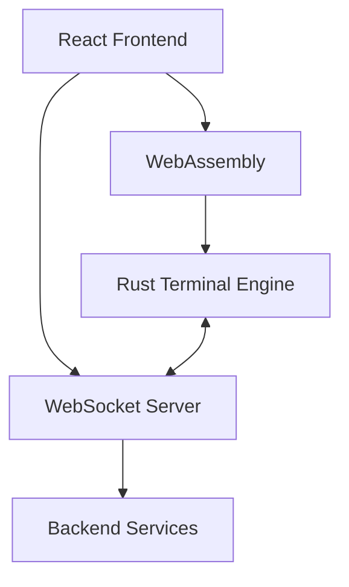

# Project Details

## Architecture Overview

Rust Terminal Forge combines the performance of Rust with the flexibility of a React frontend:



## Key Components

### 1. Core Technologies
- **Rust**: High-performance terminal processing
- **WebAssembly**: Run Rust in the browser
- **React**: Modern UI components
- **TypeScript**: Type-safe JavaScript
- **Vite**: Fast development and building
- **shadcn/ui**: Reusable UI components

### 2. Terminal Engine
- **xterm.js**: Browser-based terminal
- **WASM Bindings**: Connect Rust and JavaScript
- **Process Management**: Handle terminal sessions
- **I/O Handling**: Input/output processing

### 3. User Interface
- **Themes**: Light and dark mode support
- **Layouts**: Multiple terminal panes
- **Settings**: Customize terminal behavior
- **Responsive Design**: Works on various screen sizes

## Keyboard Shortcuts

| Key Combination | Action |
|-----------------|--------|
| Ctrl+Shift+` | New Terminal |
| Ctrl+Shift+W | Close Terminal |
| Ctrl+PageUp | Previous Terminal |
| Ctrl+PageDown | Next Terminal |
| Ctrl+Plus | Increase Font Size |
| Ctrl+Minus | Decrease Font Size |
| Ctrl+0 | Reset Font Size |

## Project Structure

```
rust-terminal-forge/
├── src/
│   ├── lib/           # Rust library code
│   │   ├── terminal/   # Terminal emulation
│   │   └── wasm/       # WebAssembly bindings
│   ├── components/     # React components
│   │   ├── terminal/   # Terminal UI components
│   │   └── ui/         # General UI components
│   ├── hooks/          # Custom React hooks
│   └── App.tsx         # Root component
├── public/             # Static assets
├── Cargo.toml          # Rust dependencies
├── package.json        # JavaScript dependencies
└── vite.config.ts      # Build configuration
```

## Terminal Features

### Supported Features
- Full UTF-8 support
- 256 colors and true color
- Mouse events
- Window resizing
- Clipboard integration
- Custom key bindings

### Performance Optimizations
- Efficient rendering with WebGL
- Memory pooling for terminal cells
- Batched screen updates
- WebWorker for background processing

## Security Considerations

1. **Sandboxing**: Terminal sessions run in a sandboxed environment
2. **Input Validation**: All user input is strictly validated
3. **Secure Connections**: WebSocket connections use WSS (secure WebSocket)
4. **Content Security Policy**: Strict CSP headers are enforced

## Known Limitations

- Some terminal applications may have compatibility issues
- Performance may degrade with very high output rates
- Mobile support is experimental

## Future Enhancements

- [ ] Add support for file transfer (SFTP/SCP)
- [ ] Implement terminal multiplexing (like tmux)
- [ ] Add plugin system for extending functionality
- [ ] Improve mobile touch support

## Contributing

1. Fork the repository
2. Create a feature branch (`git checkout -b feature/amazing-feature`)
3. Commit your changes (`git commit -m 'Add some amazing feature'`)
4. Push to the branch (`git push origin feature/amazing-feature`)
5. Open a Pull Request

## License

This project is licensed under the MIT License - see the [LICENSE](https://github.com/BA-CalderonMorales/rust-terminal-forge/blob/main/LICENSE) file for details.

## Support

For issues and feature requests, please [open an issue](https://github.com/BA-CalderonMorales/rust-terminal-forge/issues) on GitHub.
