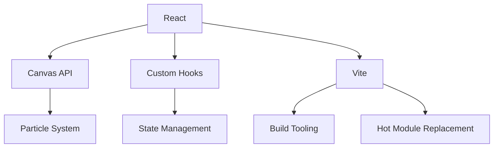

# Project Details

## Architecture Overview

Shadow Scroll Blossom is built with modern web technologies to deliver smooth, interactive particle effects:



## Key Components

### 1. Core Technologies
- **React**: Component-based UI library
- **Canvas API**: High-performance 2D rendering
- **Vite**: Fast development server and build tool
- **Tailwind CSS**: Utility-first CSS framework
- **shadcn/ui**: Reusable UI components

### 2. Particle System
- **Particle Class**: Manages individual particle behavior
- **Effect Controllers**: Different visual effects and patterns
- **Performance Optimization**: Efficient rendering with requestAnimationFrame

### 3. User Interface
- **Theme Toggle**: Switch between light and dark modes
- **Settings Panel**: Customize particle behavior
- **Responsive Layout**: Adapts to different screen sizes

## Keyboard Shortcuts

| Key | Action |
|-----|--------|
| D | Toggle Dark Mode |
| S | Toggle Settings Panel |
| R | Reset Particles |
| C | Change Color Scheme |
| Esc | Close Active Panel |

## Project Structure

```
shadow-scroll-blossom/
├── public/              # Static assets
├── src/
│   ├── components/     # React components
│   │   ├── canvas/      # Canvas and particle components
│   │   └── ui/          # UI components
│   ├── hooks/           # Custom React hooks
│   ├── lib/             # Utility functions
│   ├── styles/          # Global styles
│   └── App.tsx          # Root component
├── index.html           # Entry point
├── package.json         # Dependencies
└── vite.config.ts       # Build configuration
```

## Custom Themes

1. Add a new theme object to `src/lib/themes.ts`
2. Include color schemes for both light and dark modes
3. The theme will be automatically available in the theme selector

Example theme:

```typescript
const myTheme = {
  name: 'My Theme',
  light: {
    primary: '#3b82f6',
    secondary: '#10b981',
    background: '#ffffff',
    text: '#1f2937',
  },
  dark: {
    primary: '#60a5fa',
    secondary: '#34d399',
    background: '#111827',
    text: '#f3f4f6',
  },
};
```

## Performance Optimization

- **Request Animation Frame**: Smooth animations with efficient rendering
- **Particle Pooling**: Reuse particle objects to reduce garbage collection
- **Debounced Resize**: Optimize window resize events
- **Canvas Layer Separation**: Separate layers for different visual elements

## Known Issues

- Performance may degrade with very high particle counts
- Some mobile devices have limited touch event support
- Canvas rendering can be GPU-intensive on older devices

## Future Enhancements

- [ ] Add more particle effects and behaviors
- [ ] Implement particle pattern presets
- [ ] Add touch gesture support for mobile
- [ ] Create a particle effect gallery

## Contributing

1. Fork the repository
2. Create a feature branch (`git checkout -b feature/amazing-feature`)
3. Commit your changes (`git commit -m 'Add some amazing feature'`)
4. Push to the branch (`git push origin feature/amazing-feature`)
5. Open a Pull Request

## License

This project is licensed under the MIT License - see the [LICENSE](https://github.com/BA-CalderonMorales/shadow-scroll-blossom/blob/main/LICENSE) file for details.

## Support

For issues and feature requests, please [open an issue](https://github.com/BA-CalderonMorales/shadow-scroll-blossom/issues) on GitHub.
